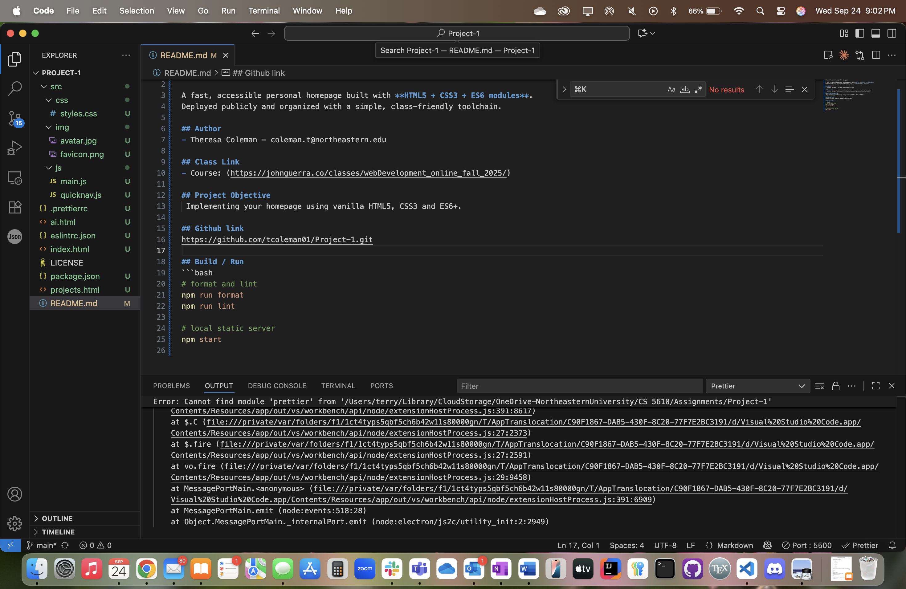

# Theresa Coleman — Project 1 Homepage

A fast, accessible personal homepage built with **HTML5 + CSS3 + ES6 modules**.
Deployed publicly and organized with a simple, class-friendly toolchain.

## Author
- Theresa Coleman — coleman.t@northeastern.edu

## Class Link
- Course: https://johnguerra.co/classes/webDevelopment_online_fall_2025/

## Project Objective
Implementing my homepage using vanilla HTML5, CSS3 and ES6+.

## Screenshot


## Live Demo
- GitHub Pages: https://github.com/tcoleman01/Project-1

## Build / Run
```bash
# format and lint
npm run format
npm run lint

# local static server
npm start
